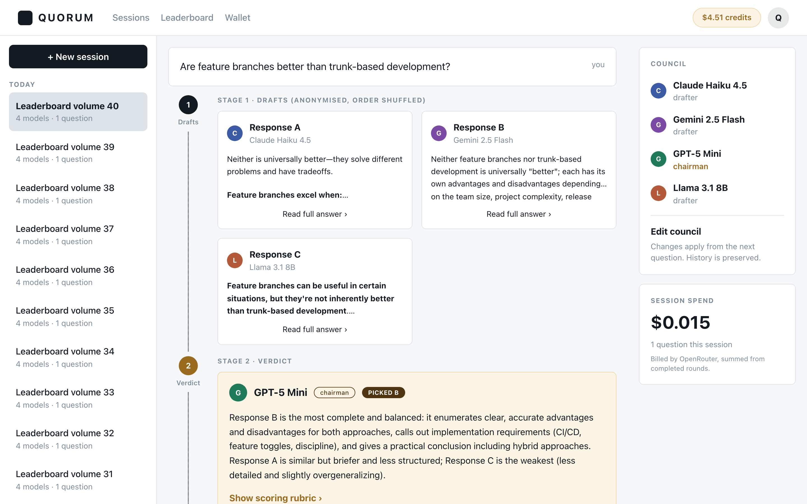

# Quorum

**Make several AI models argue, then answer.**

Quorum turns one question into a structured debate between AI models and returns
a single answer they have argued their way to — alongside the full record of how
it got there: every draft, the chairman's reasoning, and who conceded.

The premise is that **disagreement between models is a signal**, and it is
invisible when you paste the same prompt into three chat apps by hand. Quorum
makes the models read each other.

🔗 **Live:** https://quorum-gal-giladi.vercel.app · **API:** https://quorum-production-9200.up.railway.app

**What works without an account:** the landing page, and any **shared debate
link** (`/s/:token`) — the full four-stage transcript, read-only, no sign-in.
Everything else is behind auth and redirects to `/login`. Verified on production
from a browser with no cookies at all.



---

## How a round works

Four stages. For a council of N models with the chairman abstaining from
drafting:

| # | Stage | What happens | Calls |
|---|---|---|---|
| 1 | **Drafts** | Every drafting model answers independently, in parallel | N−1 |
| 2 | **Verdict** | The chairman receives the drafts **anonymised and shuffled**, then picks one, merges two, or synthesises its own | 1 |
| 3 | **Rebuttals** | Each drafter sees the verdict and may **defend, revise, or concede** | N−1 |
| 4 | **Final** | The chairman rules on the rebuttals and writes the answer | 1 |

Two decisions carry the product:

**The chairman abstains by default.** LLMs favour their own output when judging.
We measured it rather than asserting it — see the study below.

**Rebuttals permit concession, not just defence.** Defence-only makes models
entrench and stage 4 learns nothing.

**2N calls is the ceiling, not the count.** Stage 3 is skipped when the verdict
is unanimous, making it N+2. Stages 1 and 3 fan out with `Promise.allSettled`, so
one provider failing is recorded and the round continues without it.

The final answer streams token by token; the other three stages do not, because
each feeds the next and streaming them would show nobody anything sooner.

---

## A research result, not just an integration

**[Do chairmen prefer their own drafts?](docs/self-preference-study.md)** 48 real
debates, one deliberately unusual configuration, measured against chance.

The honest answer is **we could not distinguish it from chance** at this sample
size (n = 34 sole-winner rounds, p = 0.20). But the aggregate hides the
interesting part: one chairman picked itself in 15 of 15 decisive rounds and
another in 0 of 16. The null result is reported as a null result, in full, with
the interval.

---

## Stack

| | |
|---|---|
| **Client** | React 18, Vite, React Router 6, Mantine 8 |
| **API** | Node 20+, Express 4, ES modules |
| **Database** | Supabase Postgres via the `pg` driver — plain SQL migrations, no ORM |
| **LLM gateway** | OpenRouter — one key, one OpenAI-compatible endpoint, every model |
| **Auth** | Ours: bcrypt + JWT (HS256) in an httpOnly cookie |
| **Payments** | Stripe Checkout + a signed webhook (test mode) |
| **Storage** | Supabase Storage, private bucket, signed URLs minted per request |
| **Deploy** | Vercel (client) · Railway (API) |

Adding a model is a row in the `models` table, never a new adapter.

---

## Running it locally

```bash
git clone git@github.com:SlowlyFire/Quorum.git && cd Quorum

# API
cd server && npm install
cp .env.example .env          # then fill it in — see the table below
npm run migrate               # applies migrations/*.sql in order, idempotent
npm run dev                   # :3000

# Client, in another terminal
cd client && npm install
npm run dev                   # :5173
```

### Environment

Server, in `server/.env`:

| variable | required | notes |
|---|---|---|
| `DATABASE_URL` | **always** | Supabase Postgres connection string |
| `JWT_SECRET` | **always** | ≥ 32 characters is enforced when `NODE_ENV=production` |
| `OPENROUTER_API_KEY` | **always** | one key reaches every model |
| `CLIENT_URL` | no | defaults to `http://localhost:5173`; trailing slashes are stripped |
| `PORT` | no | defaults to `3000` |
| `NODE_ENV` | no | defaults to `development` |
| `SUPABASE_URL` | production | attachments; the endpoints 503 without it |
| `SUPABASE_SERVICE_KEY` | production | server-only, never shipped to the browser |
| `STRIPE_SECRET_KEY` | production | top-ups; the endpoints 503 without it |
| `STRIPE_WEBHOOK_SECRET` | production | verifies the webhook signature |

Client, in `client/.env`:

| variable | notes |
|---|---|
| `VITE_API_URL` | the API origin, no trailing slash. **`VITE_*` is compiled into the bundle and is public** — no secret belongs here. |

`config/env.js` validates all of it with Zod and refuses to boot on a bad
configuration rather than failing at the first request that needs it.

### Verification scripts

Real requests against real models. Several write to the database and say so.

```bash
npm run verify:llm          # 52 checks — templates, a real call, every mapped failure
npm run verify:debate       # 48 checks over six real debates
npm run verify:http         # 86 checks, SSE parsed off the socket
npm run verify:wallet       # 76 checks, seven real debates, a signed Stripe event
npm run verify:sharing      # 89 checks, and it costs nothing to run
npm run verify:leaderboard  # 84 checks, both attachment modalities
npm run verify:streaming    # 65 checks — the streamed answer vs the parsed one
npm run verify:deployed     # 38 checks against production, not localhost
```

---

## Endpoint audit

Every route, with what guards it. **Auth** was verified by probing all 28
endpoints without a cookie — the 22 protected ones returned 401.

| Method | Path | Auth | Ownership | Validation | Rate limit |
|---|---|---|---|---|---|
| POST | `/api/auth/register` | public | — | body | 10 / 15 min |
| POST | `/api/auth/login` | public | — | body | 10 / 15 min |
| POST | `/api/auth/logout` | public | — | no input | — |
| GET | `/api/auth/me` | ✅ | — | no input | — |
| GET | `/api/health` | public | — | no input | — |
| GET | `/api/health/db` | public | — | no input | — |
| GET | `/api/models` | ✅ | — | no input | — |
| GET | `/api/leaderboard` | ✅ | — | query | — |
| GET | `/api/presets` | ✅ | — | no input | — |
| POST | `/api/presets` | ✅ | — | body | — |
| PATCH | `/api/presets/:id` | ✅ | ✅ | params + body | — |
| DELETE | `/api/presets/:id` | ✅ | ✅ | params | — |
| POST | `/api/sessions` | ✅ | — | body | — |
| GET | `/api/sessions` | ✅ | — | query | — |
| GET | `/api/sessions/:id` | ✅ | ✅ | params | — |
| PATCH | `/api/sessions/:id` | ✅ | ✅ | params + body | — |
| DELETE | `/api/sessions/:id` | ✅ | ✅ | params | — |
| POST | `/api/sessions/:id/share` | ✅ | ✅ | params | — |
| DELETE | `/api/sessions/:id/share` | ✅ | ✅ | params | — |
| POST | `/api/sessions/:id/rounds` | ✅ | ✅ | params + body | wallet gate¹ |
| GET | `/api/rounds/:id` | ✅ | ✅ | params | — |
| GET | `/api/rounds/:id/stream` | ✅ | ✅ | params + query | — |
| GET | `/api/wallet` | ✅ | — | no input | — |
| GET | `/api/wallet/transactions` | ✅ | — | query | — |
| POST | `/api/wallet/checkout` | ✅ | — | body | — |
| POST | `/api/attachments` | ✅ | — | magic bytes² | 30 / hour |
| DELETE | `/api/attachments/:id` | ✅ | ✅ | params | — |
| GET | `/api/share/:token` | **public**³ | — | params | 60 / hour |
| POST | `/api/webhooks/stripe` | signature⁴ | — | signature | — |

¹ **Not a rate limit, on purpose.** The pre-flight entitlement check refuses a
round the user cannot afford and the wallet debits what it cost. A per-user round
cap says nothing about price and throttles a funded user identically to an empty
one.

² The route carries no body, params or query — the controller reads `req.file`
and `req.user`, so there is nothing for Zod to check. The file is validated by
**magic bytes**, never by the declared type or the filename.

³ The only unauthenticated data route, and the only thing besides the landing
page that works with no account. Its payload is built by **allow-list**, never by
stripping. Asserted against the **production** response by walking the whole tree
— 41 distinct keys — and confirming that `user_id`/`userId`, `email`,
`display_name`, every cost field, both token counts, `share_token` and a round's
`session_id` appear nowhere, while the same fields *are* present on the owner's
route, so the absence is provably the allow-list rather than empty data.
`latencyMs` stays, because it belongs to the debate rather than to the account.
A revoked token and a never-issued one return **byte-for-byte identical 404s**.

⁴ Verified against Stripe's signature over the **raw** body. The route is mounted
above `express.json()` because a parsed-and-reserialised body cannot reproduce
the bytes Stripe signed.

Ownership is `requireOwnership(loaderFn)` on every `:id` route, and the
middleware order is always `requireAuth → validate → requireOwnership` — the
loader passes `req.params.id` into a query, so a malformed id must be a 400 from
Zod rather than a 500 from Postgres.

---

## Layout

```
client/
  src/
    api/          fetch wrapper — credentials:'include', every failure an ApiError
    components/   shared and per-feature components
    context/      AuthContext
    hooks/        useRoundStream — the EventSource and its fallbacks
    lib/          round.js normalises a live stream and a persisted round into one shape
    pages/        one file per route
  vercel.json     the SPA rewrite — without it every deep link 404s
server/
  prompts/        the four debate-stage templates — inside server/ so the deploy ships them
  scripts/        verification scripts, measurements, one-off tooling
  src/
    config/       env.js (Zod-validated), llm.js, billing.js, leaderboard.js
    controllers/  request/response only
    db/           pool.js, migrate.js, migrations/
    middleware/   auth, ownership, validation, rate limits, uploads, errorHandler
    models/       all SQL — one file per table
    routes/       route definitions only
    services/     business logic and orchestration
docs/
  quorum-product-document.md   the approved spec, frozen at v1.0 — never edited
  build-log.md                 one section per build session
  decisions.md                 every deviation from the spec, with reasoning
  security.md                  the security review
  self-preference-study.md     the research result
```

## Conventions

ES modules; `async`/`await`, never `.then()` chains; named exports; thin
controllers and fat services; **all SQL in `src/models/`**, one file per table;
every error response shaped `{ error: { message, code } }` by `errorHandler` and
nowhere else; validation at the edge with Zod.

`CLAUDE.md` is the working context — the conventions above in full, plus every
trap the build has already fallen into.
